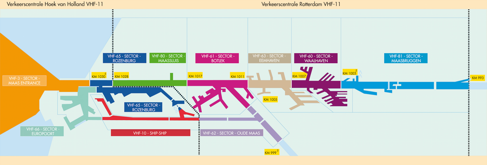

# AIS-Catcher Rijnmond VTS sector overlay

Overlay voor de AIS-Catcher kaart met de VTS-sectoren in Rijnmond en de bijbehorende VHF-kanalen.



## Huidige versie

De huidige versie is **v12** (`vts-sectoren-rws-v12.pjs`).

v12 gebruikt de officiële Rijkswaterstaat `vts-deelsector_v` sectorpolygonen als basis. Voor **Sector Oude Maas · VHF 62** is het ontbrekende westelijke deel aangevuld met officiële RWS-watergrenzen en de officiële VTS-deelsectorroute.

De aanvulling is niet met de hand langs de oever getekend. De zijkanten volgen de RWS-waterpolygon; de westelijke afsluiting is afgeleid van het officiële eindpunt en de richting van VTS-route `14184`. De aanvulling overlapt de bestaande officiële sectorpolygon licht aan de oostzijde om een kaartnaad te voorkomen.

> v12 gebruikt voor de basislaag de live RWS ArcGIS MapServer. De Oude Maas-aanvulling zelf zit lokaal in de plugin. Voor volledig offline gebruik blijft `vts-sectoren-rws-v11.pjs` beschikbaar als fallback, maar die heeft de Oude Maas west-aanvulling niet.

## Installeren

AIS-Catcher laadt alle `.pjs`-bestanden uit de ingestelde pluginmap. Gebruik daarom bij voorkeur één actief bestand voor deze overlay.

```bash
sudo mkdir -p /etc/AIS-catcher/plugins
sudo curl -fsSL https://raw.githubusercontent.com/EyeVisionsNL/AIS-catcher-VTS-rijnmond-blok-layer/main/vts-sectoren-rws-v12.pjs -o /etc/AIS-catcher/plugins/vts-sectoren.pjs
sudo chmod 644 /etc/AIS-catcher/plugins/vts-sectoren.pjs
sudo systemctl restart ais-catcher.service
```

Na het herladen van de kaart verschijnen twee gekoppelde overlays:

- `Rijnmond VTS sectoren`
- `Rijnmond VTS - Oude Maas west`

Laat beide ingeschakeld voor de volledige v12-weergave.

## Controleren

Controleer eerst of het juiste bestand is geïnstalleerd:

```bash
head -1 /etc/AIS-catcher/plugins/vts-sectoren.pjs
```

De eerste regel moet `v12` noemen.

Controleer daarna de AIS-Catcher logging:

```bash
sudo journalctl -u ais-catcher.service -n 80 --no-pager | grep -Ei 'plugin|vts|error'
```

En controleer welke plugins in de map staan:

```bash
find /etc/AIS-catcher/plugins -maxdepth 1 -type f -name '*.pjs' -print
```

## Bijwerken

Een bestaande installatie bijwerken naar de laatste v12:

```bash
sudo curl -fsSL https://raw.githubusercontent.com/EyeVisionsNL/AIS-catcher-VTS-rijnmond-blok-layer/main/vts-sectoren-rws-v12.pjs -o /etc/AIS-catcher/plugins/vts-sectoren.pjs
sudo chmod 644 /etc/AIS-catcher/plugins/vts-sectoren.pjs
sudo systemctl restart ais-catcher.service
```

Ververs daarna de AIS-Catcher kaart in de browser.

## Terug naar v11

Als tijdelijke fallback kan de vorige volledig lokale versie worden teruggezet:

```bash
sudo curl -fsSL https://raw.githubusercontent.com/EyeVisionsNL/AIS-catcher-VTS-rijnmond-blok-layer/main/vts-sectoren-rws-v11.pjs -o /etc/AIS-catcher/plugins/vts-sectoren.pjs
sudo chmod 644 /etc/AIS-catcher/plugins/vts-sectoren.pjs
sudo systemctl restart ais-catcher.service
```

## Verwijderen

```bash
sudo rm -f /etc/AIS-catcher/plugins/vts-sectoren.pjs
sudo systemctl restart ais-catcher.service
```

## VHF-sectoren

De overlay bevat de Rijnmond-sectoren voor VHF **3, 60, 61, 62, 63, 65, 66, 80 en 81**.

## Databronnen

De geometrie komt uit officiële Rijkswaterstaat datasets:

- `GDR/fis_vnds` — `vts-deelsector_v` polygonlaag 67
- `GDR/fis_vnds` — `vts-deelsector` lijnlaag 61
- `GDR/kaderrichtlijn_water` — officiële oppervlaktewaterlichamen

Repository: `EyeVisionsNL/AIS-catcher-VTS-rijnmond-blok-layer`.
