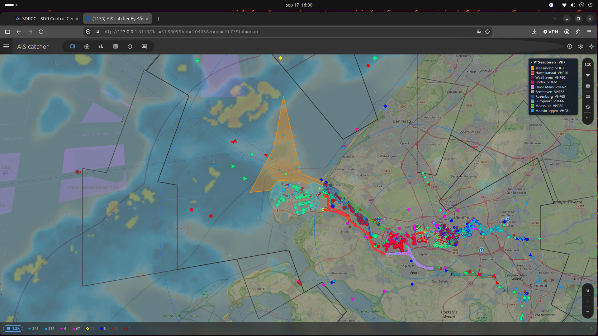

# AIS-Catcher Rijnmond VTS sector overlay

Overlay voor de AIS-Catcher kaart met de officiële Rijnmond VTS-sectoren en de bijbehorende VHF-kanalen.



## Huidige versie

De huidige versie is **v14** (`vts-sectoren-rws-v14.pjs`).

v14 gebruikt lokaal opgeslagen officiële Rijkswaterstaat `vts-deelsector_v`-polygonen. Daardoor is voor het tekenen van de sectoren geen live ArcGIS-verzoek nodig.

Belangrijkste wijzigingen in v14:

- **Sector Oude Maas · VHF62** heeft een beter zichtbare paarse kleur (`#af85f2`).
- **Sector Hartelkanaal · VHF10** is toegevoegd op basis van de officiële RWS-polygon.
- De kaart bevat een compacte **VTS-sectoren · VHF**-legenda.
- De legenda is numeriek gesorteerd: **VHF3, VHF10, VHF60, VHF61, VHF62, VHF63, VHF65, VHF66, VHF80 en VHF81**.
- Oude Maas en Hartelkanaal worden iets nadrukkelijker weergegeven zodat deze sectoren ook bij een lagere overlay-opacity goed herkenbaar blijven.

## Installeren

AIS-Catcher laadt alle `.pjs`-bestanden uit de ingestelde pluginmap. Gebruik daarom bij voorkeur één actief bestand voor deze overlay.

```bash
sudo mkdir -p /etc/AIS-catcher/plugins
sudo curl -fsSL https://raw.githubusercontent.com/EyeVisionsNL/AIS-catcher-VTS-rijnmond-blok-layer/main/vts-sectoren-rws-v14.pjs -o /etc/AIS-catcher/plugins/vts-sectoren.pjs
sudo chmod 644 /etc/AIS-catcher/plugins/vts-sectoren.pjs
sudo systemctl restart ais-catcher.service
```

Na het herladen van de kaart verschijnt de overlay:

- `Rijnmond VTS sectoren`

De legenda rechts op de kaart toont per kleur de sectornaam en het bijbehorende VHF-kanaal.

## Controleren

Controleer eerst of het juiste bestand is geïnstalleerd:

```bash
head -1 /etc/AIS-catcher/plugins/vts-sectoren.pjs
```

De eerste regel moet `v14` noemen.

Controleer daarna de AIS-Catcher logging:

```bash
sudo journalctl -u ais-catcher.service -n 80 --no-pager | grep -Ei 'plugin|vts|error'
```

En controleer welke plugins in de map staan:

```bash
find /etc/AIS-catcher/plugins -maxdepth 1 -type f -name '*.pjs' -print
```

## Bijwerken

Een bestaande installatie bijwerken naar v14:

```bash
sudo curl -fsSL https://raw.githubusercontent.com/EyeVisionsNL/AIS-catcher-VTS-rijnmond-blok-layer/main/vts-sectoren-rws-v14.pjs -o /etc/AIS-catcher/plugins/vts-sectoren.pjs
sudo chmod 644 /etc/AIS-catcher/plugins/vts-sectoren.pjs
sudo systemctl restart ais-catcher.service
```

Ververs daarna de AIS-Catcher kaart in de browser. Gebruik eventueel een harde refresh zodat de aangepaste plugin direct zichtbaar is.

## Terug naar v12

Als tijdelijke fallback kan de vorige gepubliceerde versie worden teruggezet:

```bash
sudo curl -fsSL https://raw.githubusercontent.com/EyeVisionsNL/AIS-catcher-VTS-rijnmond-blok-layer/main/vts-sectoren-rws-v12.pjs -o /etc/AIS-catcher/plugins/vts-sectoren.pjs
sudo chmod 644 /etc/AIS-catcher/plugins/vts-sectoren.pjs
sudo systemctl restart ais-catcher.service
```

## Verwijderen

```bash
sudo rm -f /etc/AIS-catcher/plugins/vts-sectoren.pjs
sudo systemctl restart ais-catcher.service
```

## VHF-sectoren

De overlay bevat de Rijnmond-sectoren voor VHF **3, 10, 60, 61, 62, 63, 65, 66, 80 en 81**.

## Databron

De sectorgeometrie is afkomstig uit de officiële Rijkswaterstaat dataset:

- `GDR/fis_vnds` — `vts-deelsector_v`, polygonlaag 67

De geometrie staat lokaal in de plugin opgeslagen.

Repository: `EyeVisionsNL/AIS-catcher-VTS-rijnmond-blok-layer`.
