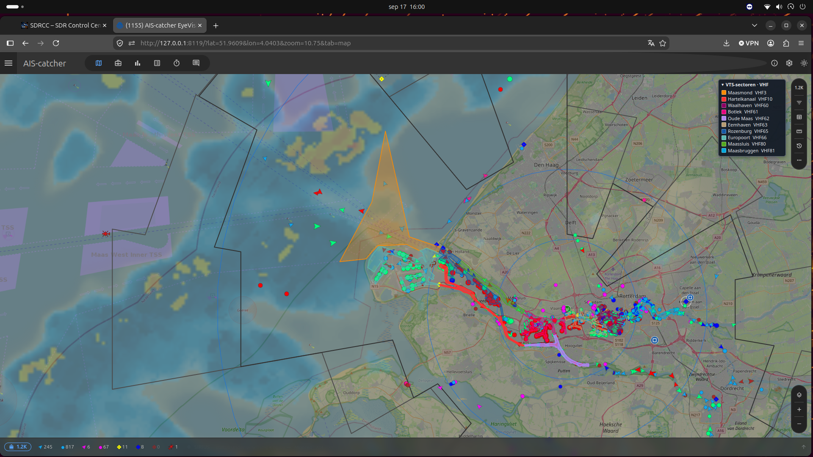

# AIS-Catcher Rijnmond VTS-sectoren · v17.1

Plugin voor de officiële Rijnmond VTS-sectoren, met actuele getij- en windgegevens bij Hoek van Holland.



## Wat zit erin

- De officiële RWS-sectorpolygonen blijven lokaal in de plugin opgeslagen.
- De legenda toont de gemeten waterstand en de astronomische getijvoorspelling.
- Onder de grafiek staat de verwachte tijd van het eerstvolgende hoogwater.
- De legenda toont ook actuele windsnelheid en windrichting van Hoek van Holland.
- Een kleine lokale relay haalt de RWS-data op. Dit is nodig omdat de RWS-webservice de browseraanvraag niet met de vereiste CORS-headers toestaat.

De VTS-legenda begint ingeklapt en onthoudt de open/dicht-keuze per browser en websiteadres. Ze staat rechtsboven naast de AIS-bediening. De paneelkleur is lichtblauw (`#adccff`); de sectorkleuren blijven de gekozen volle kleuren. Zonder browseropslag blijft de legenda bruikbaar, maar wordt de open/dicht-keuze niet na een volledige paginaverversing bewaard.

De sectorpolygonen zijn officiële Rijkswaterstaat-geometrie. De lijst is numeriek gesorteerd op VHF-kanaal: **3, 10, 60, 61, 62, 63, 65, 66, 80 en 81**. Oude Maas gebruikt paars (`#af85f2`); Hartelkanaal is opgenomen met de officiële RWS-polygon.

De relay is beperkt tot de twee RWS-endpoints die deze plugin gebruikt, locatie Hoek van Holland en de benodigde waterstands- en windmetingen. Hij luistert standaard alleen op `127.0.0.1:8120`. De installer wijzigt geen firewall- of routerinstellingen.

## Installeren of bijwerken

Clone de repository of werk een bestaande clone bij. Voer daarna één installatiecommando uit:

```bash
git clone --branch main git@github.com:EyeVisionsNL/AIS-catcher-VTS-rijnmond-blok-layer.git
cd AIS-catcher-VTS-rijnmond-blok-layer
sudo ./install.sh
```

Voor een bestaande clone:

```bash
cd ~/AIS-catcher-VTS-rijnmond-blok-layer
git pull --ff-only origin main
sudo ./install.sh
```

De installer bewaart de vorige plugin eenmalig als `/etc/AIS-catcher/plugins/vts-sectoren.pjs.pre-v17.1`, installeert de plugin en relay, schakelt de relayservice in en herstart AIS-Catcher.

## Controleren

Controleer of de relay actief is:

```bash
sudo systemctl status ais-catcher-rws-relay.service --no-pager
```

Controleer daarna de CORS-preflight van AIS-Catcher naar de lokale relay. De uitvoer hoort HTTP `204` te bevatten en de genoemde `Access-Control-Allow-*`-headers:

```bash
curl -i --max-time 5 -X OPTIONS \
  'http://127.0.0.1:8120/ONLINEWAARNEMINGENSERVICES/OphalenLaatsteWaarnemingen' \
  -H 'Origin: http://127.0.0.1:8119' \
  -H 'Access-Control-Request-Method: POST' \
  -H 'Access-Control-Request-Headers: content-type'
```

Vernieuw daarna de AIS-Catcher-pagina hard met `Ctrl+F5` en open de VTS-legenda. De getij- en windgegevens worden ververst wanneer de legenda openstaat.

Relaylogs bekijken:

```bash
sudo journalctl -u ais-catcher-rws-relay.service -n 40 --no-pager
```

## Verwijderen

Voer vanuit de repositorymap uit:

```bash
sudo ./uninstall.sh
```

De uninstallscript verwijdert de relayservice en herstelt de plugin die vóór v17.1 aanwezig was.

## VHF-sectoren

De geometrie komt uit de officiële RWS-laag `vts-deelsector_v` (FeatureServer-laag 67) en blijft beschikbaar als RWS-data tijdelijk niet bereikbaar is.
